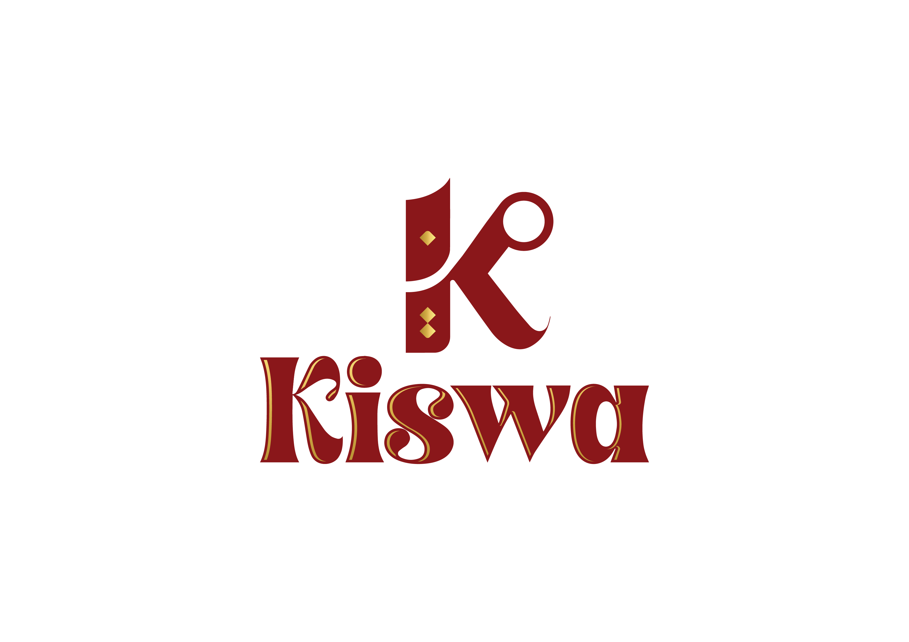

Kiswa - Modern E-Commerce Storefront

<strong>A responsive and feature-rich frontend for a modern clothing e-commerce website.</strong>
 
This project demonstrates a complete, scalable, and production-ready storefront built with a modern tech stack.

📋 Table of Contents
Live Demo

Project Preview

Features

Tech Stack & Architecture

Project Structure

Getting Started

Contact

🌐 Live Demo
Check out the live version of the project here:

➡️ View Live Site <!--- <<< 👈 REPLACE THIS WITH YOUR DEPLOYMENT LINK -->

📸 Project Preview
<!--
IMPORTANT: Add a high-quality GIF or screenshot of your application here.
This is the most important part of the README for a UI project.
You can drag and drop a GIF/image file directly into the GitHub editor.
-->

<em>(Replace this placeholder image with a screenshot or GIF of your running application!)</em>

✨ Features
This application is packed with features designed to provide a complete and intuitive e-commerce experience.

Dynamic Product Catalog: Browse a wide range of clothing items categorized for Men, Women, and Kids.

Advanced Search & Filtering: Quickly find products by name and refine results with a dedicated filter component for price, ratings, and more.

Product Details Page: View detailed information for each product, including descriptions, image galleries, and customer reviews.

Wishlist / Favorites: Save products to a personal wishlist for later.

Shopping Cart: A fully functional cart where users can add/remove items and update quantities.

User Authentication: Secure sign-up and login functionality for a personalized experience.

Comprehensive User Profile: A dedicated section where users can:

Manage personal data and addresses.

View and track their complete order history.

Manage saved payment methods.

Process product returns and view their status.

Multi-Language Support: Internationalization support using i18next allows for seamless language switching.

Fully Responsive Design: A mobile-first approach that ensures a great user experience on any device, from desktops to smartphones.

🛠️ Tech Stack & Architecture
This project was built using modern frontend technologies and follows best practices for a maintainable and scalable codebase.

Core Framework: React 18

Language: TypeScript for robust type-safety.

State Management: Redux Toolkit for efficient and predictable global state management.

Routing: React Router DOM for declarative, client-side navigation.

Styling: Tailwind CSS for a utility-first, highly customizable design system.

Build Tool: Vite for a blazing fast development server and optimized production builds.

API Communication: Axios for making asynchronous HTTP requests to the backend.

Internationalization: i18next to handle multi-language support.

Linting & Formatting: ESLint and Prettier to maintain high code quality and consistent style.

📂 Project Structure
The project's code is structured using Atomic Design principles to promote reusability and a clear separation of concerns.

/src
├── /assets         # Static assets like images and fonts
├── /components     # Reusable UI components
│   ├── /atoms      # Basic building blocks (Button, Input, etc.)
│   ├── /molecules  # Groups of atoms (SearchBar, ProductCard, etc.)
│   └── /organisms  # Complex components (Navbar, Footer, ProductsGrid)
├── /context        # React Context providers (ShopContext, LanguageProvider)
├── /hooks          # Custom React hooks
├── /pages          # Application screens/views
├── /services       # API calls and authentication logic
├── /types          # TypeScript type definitions
└── /utils          # Helper functions and utilities

This structure makes it easy to locate components and understand their level of complexity, which is crucial for scalability and team collaboration.

🚀 Getting Started
To get a local copy up and running, follow these simple steps.

Prerequisites
Make sure you have Node.js and npm (or yarn) installed on your machine.

Node.js (v18.x or higher is recommended)

npm or yarn

Installation & Setup
Clone the repository:

git clone [https://github.com/your-username/your-repo-name.git](https://github.com/your-username/your-repo-name.git)

Navigate to the project directory:

cd your-repo-name

Install the dependencies:

npm install

(or yarn install if you prefer Yarn)

Running the Application
Once the dependencies are installed, you can run the development server:

npm run dev

The application will now be running and accessible at http://localhost:5173.

